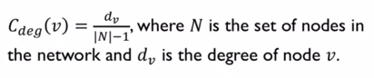
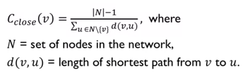
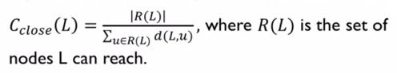
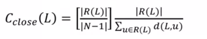
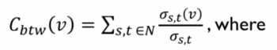
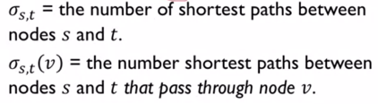

# 3. Influence Measures & Network Centralization 

## Network Centrality 
Measure to identify most important nodes in a network. Applications for identification of these nodes:
-	Influential nodes in a social network
-	Nodes that disseminate information to many nodes or prevent epidemics
-	Hubs in a transportation network 
-	Important pages on the internet 
-	Nodes that prevent network failure

#### Some Centrality Measures
Degree Centrality, Closeness Centrality, Betweenness Centrality, Load Centrality, PageRank, Katz Centrality, Percolation Centrality 

### Degree Centrality

_Assumption:_ Important nodes have many connections (# of neighbors).

_Undirected networks:_ use degree || _Directed networks:_ use in-degree and out-degree



Centrality ∈ [0,1] 

1 -> Node connected to every single node in the network 

0 -> Node not connected to any node in network  

### Closeness Centrality 
_Assumption:_ Important nodes are close to other nodes. 



### Measuring Closeness Centrality for disconnected nodes 

<b>Option #1:</b> Consider only nodes that a node L can reach:



_Drawback:_ Centrality may be too high for a node that is connected to just one other node, hence unintuitive results. 

<b>Option #2:</b> Consider only the nodes that a node L can reach and normalize by the fraction of nodes L can reach:



### Betweenness Centrality 
_Assumption:_ Important nodes connect other nodes. 

 

Endpoints: Can either include or exclude node v as node s or node t in the computation of centrality. 

### Normalization 
Required as betweenness centrality values will be larger for graphs with many nodes. To control this, divide centrality by the number of pairs of nodes in graph (excluding v):

<b>0.5(|N|-1)(|N|-2)</b> in undirected graphs, <b>(|N|-1)(|N|-2)</b> in directed graphs

This is useful to compare centrality across networks. 

### Betweenness Centrality – Complexity 
Computing betweenness centrality of all nodes can be computationally expensive – up to O(|N|^3).

_Approximation:_ rather than computing centrality based on all possible pairs of nodes, approximate it based on a subset of nodes. 

## PageRank

Developed by Google co-founders to measure importance of webpages within the hyperlink network structure of the web. 
PageRank assigns a score of importance to each node. (Circular Definition: A node’s PageRank depends on the PageRank of other nodes). PageRank can be used for any kind of network, but mostly used for directed networks. 

n = number of nodes in network, k = number of steps 

1.	Assign all nodes a PageRank of 1/n. (Sum of PageRank of all nodes is going be constant (=1)).
2.	Perform the Basic PageRank Update Rule k times. (_Basic PageRank Update Rule:_ Each node gives an equal share of its current PageRank to all the nodes it links to.)
3.	The new PageRank of each node is the sum of all the PageRank it received from other nodes that point to it. 
4.	For most networks, the PageRank values for the nodes start to converge as k approaches infinity.

_Drawback:_ Due to the random walk traversal, in some networks, PageRank calculation may be skewed due to node loops in the network. 

## Scaled Page Rank

Scaled PageRank addresses the above problem by introducing a “damping parameter” α, such that the random walker chooses a random outgoing edge with probability (α) and chooses a random node to jump to with a probability of (1-α). 

[Typically α is chosen to be between 0.8 and 0.9]

## Hubs and Authorities 
Another approach developed in the context of how a search engine may find important web pages given a user search query.

#### Step 1: Find ROOT set
Find set of highly relevant web pages (e.g. pages that contain the query string) – potential <b>authorities.</b>
Find all pages that link to a page in the root – potential <b>hubs.</b> Hubs are not relevant to the query submitted by user but are pointing/linked to pages that are relevant. 

#### Step 2: Find BASE set 
Find set of root nodes + any node (authorities + hubs) that links to a node in root. Consider all edges connecting nodes in the base set. 

#### Step 3: Run HITS algorithm
Unlike PageRank, instead of taking the full network, a subset of the network (base set) is considered. 

<b>> HITS Algorithm</b>

Computing k iterations of the HITS algorithm to assign an authority score and hub score to each node. 

1.	Assign each node an authority and hub score of 1
2.	_Apply the Authority Update Rule:_ each node’s authority score is the sum of hub scores of each node that points to it
3.	_Apply the Hub Update Rule:_ each node’s hub score is the sum of authority scores of each node it points to
4.	Normalize Authority and Hub scores: ```auth(j) = auth(j) / SUM(auth(j))```
5.	Repeat k times 
6.	For most networks, as k gets larger, authority and hub scores converge to a unique value

_Intuition:_ Nodes that have incoming edges from good hubs are thought to be good authorities, nodes that have outgoing edges to good authorities are thought to be good hubs. 


